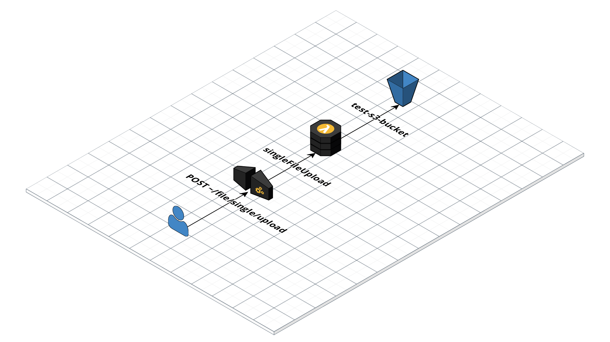
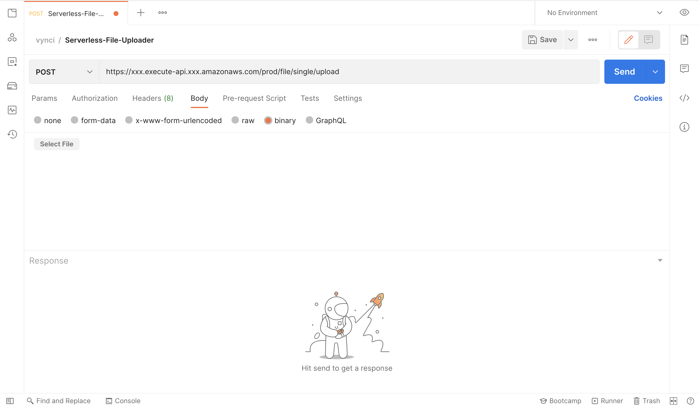
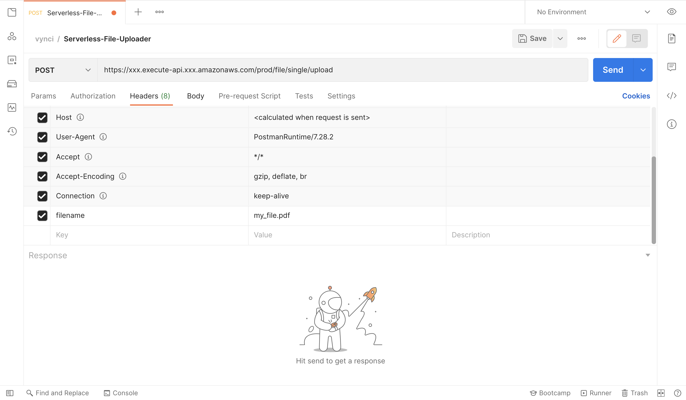

## Overview

This is a quick implementation of a File Uploader API that is deployed in AWS using API Gateway, Lambda, and S3. This API can upload any file type. We will be using Nodejs along with serverless framework to help us easily deploy services in AWS.



## Objective

In this simple implementation, We want to upload any file type as a binary. This action will be triggered by the user through an HTTP POST method. The binary file will be in the body as a payload. Once the data arrives in the cloud (AWS Lambda), we will then prepare that data to be stored in S3. Once successfully stored, we will return a response back to the user with the URL that specifies the location of the file uploaded.

If you want to skip directly into the source code, you can check it out [here](https://github.com/vynci/serverless-file-upload-api)

## Let's Dive in!

We will now discuss things in detail on how the data will be (1) passed from the frontend, (2) processed in the cloud, (3) then send a response back to the user.

### Frontend

For testing purposes, we'll be using POSTMAN as the frontend. We can easily specify the body type in the payload here. Let us set that as "binary" and upload the file by clicking "Select File".



We also need to add a parameter in the headers that will specify our file name, lets just call that filename (you can use any prop name here you want), then we'll be having the value of the filename (my_file.pdf).



### Backend

Once we click on the "Send" button it will now execute a POST request to the API, and then AWS API Gateway will trigger an event to our lambda function, at the same time passing the headers and body in the event object.

From the event object, we will be extracting both the filename from the headers and the body of the actual binary file.

```js
export const singleFileUpload = async (event) => {
    const filename = event.headers.filename;
    const binary_file = event.body
...
```

Now that we have the data on the lambda side, we have to convert first the binary file which is being translated into base64 when we upload that through the frontend and HTTP into a Buffer, this is how S3 writes that file, which also the same when you do a filesystem write in Nodejs. Here is the code for that:

```js
const bufferData = new Buffer(binary_file, 'base64');
const path = folderPath + `${new Date().getTime()}_${filename}`;

const params = {
  Body: bufferData,
  Bucket: env.fileBucket,
  Key: path
};

const s3Result = await s3.putObject(params).promise();
```

The result from the s3.putObject promise is just an ETag, we will not be using that, but we'll just include that in the response object to the user.

Now that the data is stored in S3, we will be returning a 200 response to the user with the URL of the uploaded file.

```js
return {
  statusCode: 200,
  headers: { 'Access-Control-Allow-Origin': '*' },
  body: JSON.stringify({
    data: {
      status: 'success',
      s3Result,
      fileUrl: env.fileRootPath + path
    }
  })
};
```

We'll now be expecting this sample response from the backend to the frontend:

```json
{
  "data": {
    "s3Result": {
      "ETag": "\"72366728430770497f95a541c3f010e4\""
    },
    "status": "success",
    "fileUrl": "https://s3-xxx.amazonaws.com/test-s3-bucket-prod/test_folder/1666644793194_my_file.pdf"
  }
}
```

## Deployment

Since we are using serverless framework for this demonstration. We need need to specify first the `serverless.yml` file which serves as a config file on how these services will be deployed to AWS.

On this line here, we'll just input the name we want for this service.

```yaml
service: serverless-file-upload-api
```

On the provider property, we'll specify here the node runtime that is going to be used, the region on which this service is going to be deployed as well as the environment (staging or production), and the permission needed for us to be able to write to the S3 bucket.

```yaml
provider:
  name: aws
  runtime: nodejs12.x
  region: us-east-1
  environment: ${file(env.yml):${self:custom.stage}}
  iamRoleStatements:
    - Effect: 'Allow'
      Action:
        - 's3:PutObject'
      Resource: 'arn:aws:s3:::${self:provider.environment.fileBucket}/*'
```

We can then now specify the lambda function and the API gateway that will trigger it.

```yaml
functions:
  singleFileUpload:
    handler: src/handlers/main.singleFileUpload
    events:
      - http:
          method: post
          path: file/single/upload
          cors: ${self:custom.cors}
```

Now everything is ready, we can deploy this now using the serverless framework CLI tool.

```shell
$ node --max-old-space-size=8192 ./node_modules/.bin/serverless deploy -s prod -v
```

One more thing, we need to configure the API gateway to accept binary media types. We can do that by going into your API gateway settings.

Add this value `*/*` , API Gateway will look at the Content-Type and Accept HTTP headers to decide how to handle the body.

We need to redeploy the whole service again for this to work. Once deployed, that is it. You have now a simple working file uploader that you can use in your application.

## Summary

We have now the idea on how to implement a simple serverless binary file uploader. We have discussed here the flow of the data that is being passed from the frontend into the backend, then return a response back to the frontend with the URL of the file stored in the cloud. Now that we know the concept, we can easily extend this to accept multiple files, Or even perform any further processing on the files that are being uploaded like creating multiple sizes for that certain image or video.

I had fun writing this article, I hope you learned from this. And I would love to get some feedbacks. Thanks! :)
