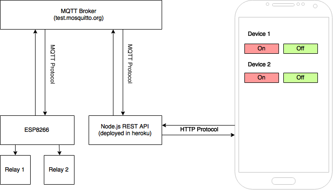
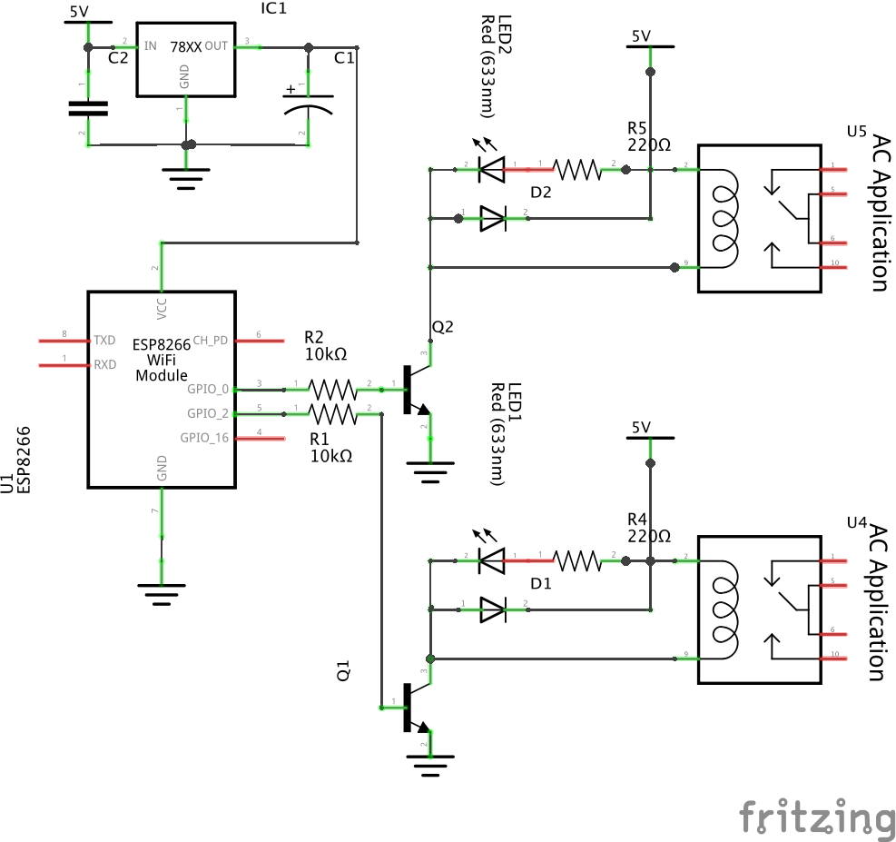

## Overview

The goal of this article is to create a very simple low level IoT application. This focuses more on how to build it from the ground up without using existing IoT Platform as service such AWS IoT, IBM Bluemix, Samsung or Artik.


The system is based on a very cheap $3 wifi module - ESP8266 which connects to the Node.js REST API server via Mosquitto's free online MQTT Broker (test.mosquitto.org). The Android Mobile App is built using Ionic Framework utilizing AngularJs.

The REST API Server is hosted on a cloud server(heroku) which enables the relays to be controlled online via internet.

The diagram below illustrates the connection flow of the system. The ESP8266 Wifi Module should be connected to the internet through wifi for this to work, as well as your mobile device.



This article shows you how to make your own REST API server for the ESP8266 and your Mobile App to communicate via MQTT. You can use the existing REST API server that is deployed in Heroku(http://esp8266-relays.herokuapp.com) or you can deploy your own. If you don't want to use "test.mosquitto.org" as your MQTT Broker, you can have your own by downloading and installing the Mosquitto here.

## Requirements

### Hardware

- ESP8266
- 5V Power Supply ( at least 1A )
- 3.3V Voltage Regulator
- 5V Relays
- 2N2222A Transistor
- Resistors
- Capacitors
- 1N4108 Diodes
- LEDs

### Software

- Node.js
- Ionic Framework
- Arduino IDE

## Assembling the Circuit

The ESP8266 chip module is not 5V tolerant, so you have to add a 3.3V regulator. I used KIA78R25API in this project. It is a 1A 4 TERMINAL LOW DROP VOLTAGE REGULATOR, with built-in ON/OFF Control Terminal. The transistors are used to drive the 3.3V signal from the ESP8266 to 5V for it to be able to control the relays.



## Preparing the Software

1. Download Node.js here. The installation procedure depends on your operating system. To test if Node.js has been installed properly, you should be able to run these commands and display the current version.

`$ node -v`

`$ npm -v`

2. Install Ionic Framework from here. Ionic Framework is dependent with node.js, so you must install it first.

3. In setting up the Arduino IDE for ESP8266, you can go to my previous article **here**.

## Diving into the code

There are three code modules which are the MQTT Client + REST API Server, ESP8266 Arduino, and the Ionic Mobile App Framework.

You can get the codes in these github repos.

- REST API Server + MQTT Client - https://github.com/vynci/MQTT-REST-API
- ESP8266 Arduino - https://github.com/vynci/esp8266-relay
- Ionic Mobile App - https://github.com/vynci/esp8266-ionic

### REST API Server + MQTT Client

This first module is the server that has been deployed to heroku (http://esp8266-relays.herokuapp.com). You can create your own server locally or by deploying it in the cloud. This node application requires two modules, Hapi.js is a REST API framework while MQTT.js is an mqtt client.

This block initializes the REST API server, as well as establishes a connection with the MQTT broker.

```js
var Hapi = require('hapi');
var mqtt = require('mqtt');

var server = new Hapi.Server();
var port = Number(process.env.PORT || 4444);

server.connection({ port: port, routes: { cors: true } });

var client = mqtt.connect('mqtt://test.mosquitto.org:1883');
```

This function is for publishing messages to the broker.

```js
var mqttPublish = function (topic, msg) {
  client.publish(topic, msg, function () {
    console.log('msg sent: ' + msg);
  });
};
```

This block creates a route for the '/device/control' POST Method, wherein if this route is being called it will execute the mqttPublish function. The 'deviceInfo' variable contains the message for the ESP8266 to translate, wherein 'dev1-on' turns the relay 1 on, 'dev1-off' off and same thing for 'dev2-on' and 'dev2-off'.

```js
server.route([
  {
    method: 'POST',
    path: '/device/control',
    handler: function (request, reply) {
      var deviceInfo = 'dev' + request.payload.deviceNum + '-' + request.payload.command;
      reply(deviceInfo);
      mqttPublish('device/control', deviceInfo, {
        qos: 2
      });
    }
  }
]);

server.start();
```

The first parameter in the mqttPublish function 'device/control' is the topic wherein our ESP8266 listens to, then the second parameter is where the message 'deviceInfo' is being passed to. The 'qos' means quality of service. It is a level of agreement between sender and receiver of a message regarding the guarantees of delivering a message. To know more about it, you can read it here.

After you've downloaded the node app from this github repo, you can run it by:

`$ npm install`

`$ node index.js`

This creates a REST API server wherein the mobile application can connect to. This also establishes a connection with the MQTT Broker(test.mosquitto.org).

You can follow this tutorial from heroku if you want to deploy your own server in the cloud.

### ESP8266 Arduino Code

This code block connects the ESP8266 to the wifi network by specifying the SSID and password. This block also establishes a connection with the MQTT broker.

```c
#include <PubSubClient.h>
#include <ESP8266WiFi.h>

const char* ssid = "your-wifi-ssid";
const char* password = "your-wifi-passwd";

char* topic = "device/control";
char* server = "85.119.83.194"; // IP of test.mosquitto.org

WiFiClient wifiClient;
PubSubClient client(server, 1883, callback, wifiClient);
.....
```

To flash this code to the ESP8266 using the Arduino IDE, you can follow the steps here in my previous article.

### Ionic - Mobile App

This file(services.js) right here connects to the REST API server, doing a POST method containing the command information in the payload.

```js
angular
  .module('starter.services', [])

  .factory('Devices', function ($http) {
    var ipServer = 'http://esp8266-relays.herokuapp.com';

    return {
      deviceCommand: function (data) {
        console.log(data);
        return $http.post(ipServer + '/device/control', data);
      }
    };
  });
```

You can run this mobile app through your browser by executing the command in your project's root folder:

`$ ionic serve`

If you want to build and install it on your mobile device you can run:

`$ ionic platform add android`

`$ ionic run android`

I'm not going to explain the process of installing the necessary libraries to build android/ios apps. You can follow the instructions here in the documentation guide on Ionic Framework's website.

## Conclusion

This article explains a basic construction of an Internet of Things(IoT) Device which connects to an MQTT broker and listens to a channel for incoming data through the Node.js REST API server. The mobile application then connects to the server, which enables it to send commands to the ESP8266 then into the Relays.

This implementation is for education purpose only, and does not contain any Authorization and Authentication layers hence it is not secured. There are a lot of things that could still be improved. For instance, channeling the MQTT through Websockets instead of HTTP. Instead of using relays, you can use TRIACS which is more safer and efficient on the long run. And by adding an admin dashboard for the ESP8266 side, wherein you can add a form for a dynamic saving of WIFI SSID and Password so that you wouldn't need to re-program the chip just to change the WIFI credentials.

The ESP8266 is very cheap yet a very powerful wifi module. You can do a lot with it, this article just shows a "Hello World" equivalent application. I hope you've learned a lot with this article, and build your own awesome IoT device!
