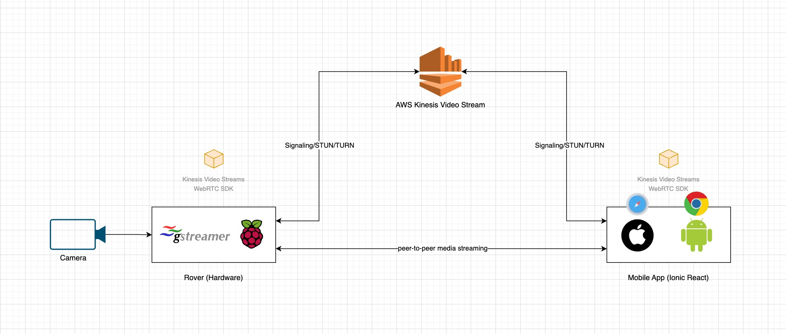
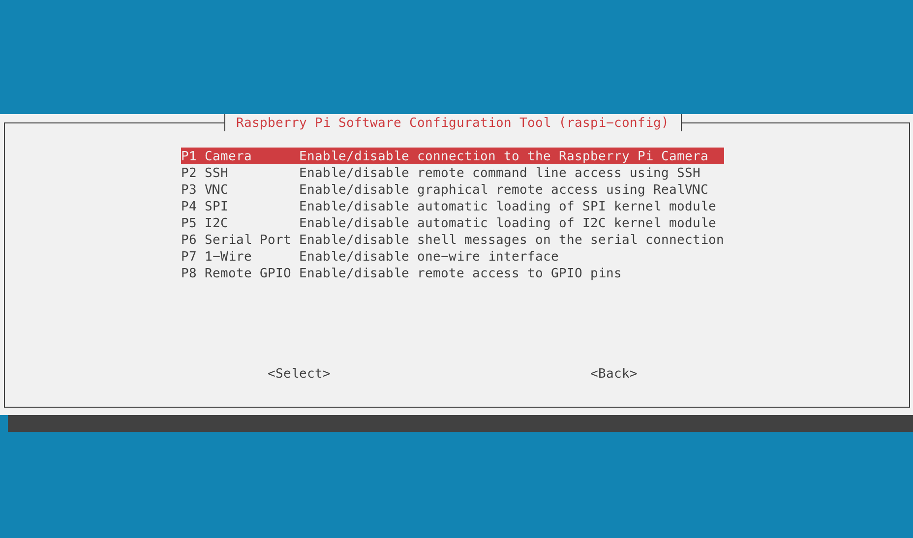

## Overview

This is the second part of the project that tackles on sending a peer-to-peer video stream from the rover's onboard camera into our frontend mobile application using WebRTC and AWS Kinesis Video Stream (KVS) as the Signaling Server.


### Recap

In [Part 1](/posts/robot-control-using-aws-iot-core), we have covered how to build a rover and control the motors over the internet using MQTT. We also got into the frontend (UI/UX) side of things, wherein we used React with the Ionic framework to create a mobile application with the joystick library to control the steering. If you haven’t read the [first part](/posts/robot-control-using-aws-iot-core) yet, I suggest going through it to get an overview.

### Source Code

If you want to dive right away into the code for this article, you can check it out here:

- [Rover Hardware](https://github.com/vynci/rovy-hardware/tree/rovy-part-2) (branch -> `rovy-part-2`)
- [Mobile App](https://github.com/vynci/rovy-mobile/tree/rovy-part-2) (branch -> `rovy-part-2`)

> I will be pushing updates to the repositories as I add more things (i.e sensors) into the rover as I progress in the future, so the main branch might look different by the time you are reading this. As for this article, please refer to the specified branch.

## Architecture

The diagram below illustrates the high-level view of the system’s workflow on streaming video from the rover's camera to the mobile application via WebRTC. This article leans a lot into WebRTC, you can go through the [fundamentals](https://webrtc.org/) to get an overview of the peer-to-peer concept.



## Hardware

In this part of the project, we'll be focusing on two components which are the Raspberry Pi and Camera.


### Schematic

We simply connect our Camera directly into the Raspberry Pi through the [Camera Serial Interface (CSI)](https://en.wikipedia.org/wiki/Camera_Serial_Interface)


### Camera

The camera that we will be using is the [Raspberry Pi Camera Module 2](https://www.raspberrypi.com/products/camera-module-v2/). The v2 Camera Module has a Sony IMX219 8-megapixel sensor (compared to the 5-megapixel OmniVision OV5647 sensor of the original camera).


You can read all the gory details about IMX219 and the Exmor R back-illuminated sensor architecture on Sony’s website, but suffice to say this is more than just a resolution upgrade: it’s a leap forward in image quality, colour fidelity, and low-light performance. It supports 1080p30, 720p60, and VGA90 video modes, as well as still capture.

### Raspberry Pi connection

The connection between the camera and Raspberry Pi is simple, it attaches via a 15cm ribbon cable to the CSI port on the Raspberry Pi.


The camera works with all models of Raspberry Pi 1 to 5. It can be accessed through the MMAL and V4L APIs, and there are numerous third-party libraries built for it.

## Setup

The operating system we have on this project is a Raspbian (Buster). The very first thing we need to do is enable the Camera Interface. In our terminal, we enter:

```shell
$ sudo raspi-config
```

Once you are inside the raspi-config user interface. Go to `[3] Interface Options`.


Select the `[P1] Camera` and press the `Enter` key to enable the camera serial interface



### Install linux libraries

For us to be able to stream the video data from the camera into the aws-kvs-sdk we need to install the necessary `gstreamer` libraries

On the terminal, we have to do an `apt-get`:

```shell
$ sudo apt-get install libssl-dev libcurl4-openssl-dev liblog4cplus-dev libgstreamer1.0-dev libgstreamer-plugins-base1.0-dev gstreamer1.0-plugins-base-apps gstreamer1.0-plugins-bad gstreamer1.0-plugins-good gstreamer1.0-plugins-ugly gstreamer1.0-tools
```

> By default `pkg-config` and `CMake` are installed in Raspbian, if not then you also need to install these and a build environment.

### Download KVS SDK

The next step is to download the sdk from the **awslabs** github repository.

```shell
git clone --recursive https://github.com/awslabs/amazon-kinesis-video-streams-webrtc-sdk-c.git
```

### Building the AWS KVS SDK

We need to create a build directory in the newly checked out repository, and execute `CMake` from it.

```shell
$ mkdir -p amazon-kinesis-video-streams-webrtc-sdk-c/build; cd amazon-kinesis-video-streams-webrtc-sdk-c/build; cmake ..
```

To build the library and the provided samples run make in the build directory you executed `CMake`.

```shell
$ make
```

The build will take a while to complete, so get yourself a coffee while waiting 😉

### Setting the AWS environment variables

On our Raspberry Pi terminal, we need to run:

```shell
$ export AWS_ACCESS_KEY_ID= <AWS account access key>
$ export AWS_SECRET_ACCESS_KEY= <AWS account secret key>
$ export AWS_DEFAULT_REGION= <AWS region>
```

For the IAM User, we are going to set the permission on the action field as a wildcard `*` for now. We can add a more strict security later on.

```json
{
  "Version": "2012-10-17",
  "Statement": [
    {
      "Effect": "Allow",
      "Action": "kinesisvideo:*",
      "Resource": "arn:aws:kinesisvideo:<region>:<acct_id>:stream/test-stream/<acct_id>"
    }
  ]
}
```

### Create a stream on KVS

The next step we need to do is to create a stream on AWS side. On the AWS Console, we need to go to `Kinesis Video Stream`, then `Video streams`, then click on `Create video stream` button.

And we'll be prompted with this page:


We can input any name we want for the video stream (it must be unique). We'll just select the `Default configuration` on the KMS configuration for now. We can also add tags as an option.

### Testing the video stream

In the build folder, go to samples, then run `kvsWebrtcClientMasterGstSample`

```shell
$ ./kvsWebrtcClientMasterGstSample <channelName>
```

In our case, we have `test-stream` as the channel name of the KVS stream.

```shell
$ ./kvsWebrtcClientMasterGstSample test-stream
```

The output in the terminal would look this:


In this part, we can already do a quick test if the video transmission actually works. We can go to the [KVS WebRTC Test Page](https://awslabs.github.io/amazon-kinesis-video-streams-webrtc-sdk-js/examples/index.html), which is a sample browser client that AWS has developed. You can also spin this up locally by pulling the repository from [here](https://github.com/awslabs/amazon-kinesis-video-streams-webrtc-sdk-js).


You will initially be prompted with the AWS region, credentials, and other options, but it should be quick and easy to get started.

## Integrating with Nodejs

Now that we are assured that our camera and sdk are working properly with the video transmission to AWS KVS, the next thing we need to do is to make it run along with our motor controller Nodejs code.

I copied `kvsWebrtcClientMasterGstSample` executable file that we built earlier into a directory `~/rovy-cam` (_It can be any directory you want_).

In the code, I added a child process that will execute the kvs client.

```js
const { spawn } = require('child_process');

const kvsClient = spawn('/home/pi/rovy-cam/kvsWebrtcClientMasterGstSample', ['test-stream']);

kvsClient.stdout.on('data', (data) => {
  console.log(`stdout: ${data}`);
});

kvsClient.stderr.on('data', (data) => {
  console.error(`stderr: ${data}`);
});
```

This will also give us an event listener that will enable us to monitor the logs of the incoming KVS responses. Managing the stream startup during boot would also now be easier, as we are managing everything in one place.

## Frontend

We will now proceed with the "Viewer" end of the video stream, which we will append to the mobile app that we have developed from [Part 1](/posts/robot-control-using-aws-iot-core#frontend). The concept that we are implementing here will be similar to the [KVS WebRTC Test Page](https://awslabs.github.io/amazon-kinesis-video-streams-webrtc-sdk-js/examples/index.html) that we used earlier to test the video stream.

### Environment setup

In our frontend mobile app's [code base](https://github.com/vynci/rovy-mobile/tree/rovy-part-2), we need to install these libraries.

```shell
$ npm install @aws-sdk/client-kinesis-video @aws-sdk/client-kinesis-video-signaling amazon-kinesis-video-streams-webrtc
```

> In [Part 1](/posts/robot-control-using-aws-iot-core#frontend), there is a more detailed discussion on how the frontend has been setup with Ionic and React.

### AWS KVS Client connection

We'll create a react component called `KinesisWebRTC`, and import the libraries that we just installed.

```tsx
import {
  KinesisVideoClient,
  DescribeSignalingChannelCommand,
  GetSignalingChannelEndpointCommand
} from '@aws-sdk/client-kinesis-video';

import {
  KinesisVideoSignalingClient,
  GetIceServerConfigCommand
} from '@aws-sdk/client-kinesis-video-signaling';

import { SignalingClient } from 'amazon-kinesis-video-streams-webrtc';
```

I have created a constant object that would serve like an enum that we'll be using later.

```tsx
const OPTIONS = {
  TRAVERSAL: {
    STUN_TURN: 'stunTurn',
    TURN_ONLY: 'turnOnly',
    DISABLED: 'disabled'
  },
  ROLE: {
    MASTER: 'MASTER',
    VIEWER: 'VIEWER'
  }
};
```

I have also intially defined here the configuration needed to connect into AWS KVS.

```tsx
const state: any = store({
  accessKey: process.env.AWS_ROVY_KEY,
  secretAccessKey: process.env.AWS_ROVY_SECRET,
  sessionToken: '',
  region: process.env.AWS_ROVY_REGION,
  role: OPTIONS.ROLE.VIEWER,
  channelName: 'test-stream',
  clientId: getRandomClientId(),
  endpoint: null,
  natTraversal: OPTIONS.TRAVERSAL.STUN_TURN,
  useTrickleICE: true,
  playerIsStarted: false,
  signalingClient: null,
  remoteView: null,
  peerConnectionStatsInterval: null,
  peerConnectionByClientId: {}
});
```

> I am using [react-easy-state](https://github.com/RisingStack/react-easy-state) for now to manage the states. I might refactor this in the future to just only use the native `useState`.

This will be our component for the video player. Which is a `<video>` embed element.

```tsx
const VideoPlayers = view(() => {
  return (
    <>
      <div id="video-players">
        <video
          style={{
            width: '100vw',
            height: '100vh',
            objectFit: 'cover',
            position: 'fixed',
            top: 0,
            left: 0
          }}
          ref={state.remoteView}
          autoPlay
          playsInline
          muted
        />
      </div>
    </>
  );
});
```

The entry point for the `KinesisWebRTC` is the code block below:

```tsx
const KinesisWebRTC = view(({ setKvsStatus }) => {
  state.remoteView = useRef(null);
  setStatus = setKvsStatus;

  useEffect(() => {
    startPlayer();
  }, []);

  return <>{state.playerIsStarted ? <VideoPlayers /> : null}</>;
});

function startPlayer() {
  state.playerIsStarted = true;

  startPlayerForViewer();
}
```

The function `startPlayerForViewer()` handles all the signaling workflow between the browser, AWS KVS, and the Rover.

```tsx
async function startPlayerForViewer() {
  const kinesisVideoClient = new KinesisVideoClient({
    region: state.region,
    endpoint: state.endpoint || null,
    credentials: {
      accessKeyId: state.accessKey,
      secretAccessKey: state.secretAccessKey,
    },
  });

  const describeSignalingChannelCommand = new DescribeSignalingChannelCommand({
    ChannelName: state.channelName,
  });

  const describeSignalingChannelResponse: any = await kinesisVideoClient.send(
    describeSignalingChannelCommand
  );

  ...
```

### Status monitor

To monitor and display the connection status in the UI, we have added here `setStatus()` that will set the global state into our `StatusMonitor` component.

```tsx
state.signalingClient.on('iceCandidate', (candidate: any) => {
  setStatus('connected');
  state.peerConnection.addIceCandidate(candidate);
});

state.signalingClient.on('close', () => {
  setStatus('disconnected');
});

state.signalingClient.on('error', (error: any) => {
  setStatus('error');
});

state.peerConnection.addEventListener('icecandidate', ({ candidate }: any) => {
  if (candidate) {
    if (state.useTrickleICE) {
      state.signalingClient.sendIceCandidate(candidate);
    }
  } else {
    setStatus('waitingForHost');
    if (!state.useTrickleICE) {
      state.signalingClient.sendSdpOffer(state.peerConnection.localDescription);
    }
  }
});

...
```

### Integration

After importing our `KinesisWebRTC` component, this how our `Home.tsx` would look like now together with the `JoystickControllers` and `StatusMonitor`.

```tsx
import { IonContent, IonPage } from '@ionic/react';
import KinesisWebRTC from '../components/KinesisWebRTC';
import JoystickControllers from '../components/JoystickControllers';
import StatusMonitor from '../components/StatusMonitor';
import './Home.css';
import { useState } from 'react';

const Home: React.FC = () => {
  const [mqttStatus, setMqttStatus] = useState<string>('pending');
  const [kvsStatus, setKvsStatus] = useState<string>('pending');

  return (
    <IonPage>
      <IonContent class="main-content" fullscreen>
        <JoystickControllers setMqttStatus={setMqttStatus} />
        <StatusMonitor mqttStatus={mqttStatus} kvsStatus={kvsStatus} />
        <KinesisWebRTC setKvsStatus={setKvsStatus}></KinesisWebRTC>
      </IonContent>
    </IonPage>
  );
};

export default Home;
```

### Testing the Ionic App

Once everything is in place, npm libraries are installed, KVS stream is running, then we can run:

```shell
$ ionic serve
```

This will run a web server instance (live reload) that you can test and develop with.


## Summary

In this article, we have covered the video streaming part of the rover's camera. We used the `amazon-kinesis-video-streams-webrtc-sdk-c` library on the Raspberry Pi side to stream the video to AWS Kinesis.


On the frontend side, we have added a new component called `KinesisWebRTC` that uses the `@aws-sdk/client-kinesis-video`, `@aws-sdk/client-kinesis-video-signaling`, and `amazon-kinesis-video-streams-webrtc` libraries to handle the WebRTC connection and video player rendering.

I hope you enjoy reading this, and stay tuned for the upcoming updates of this project. Thank you!
