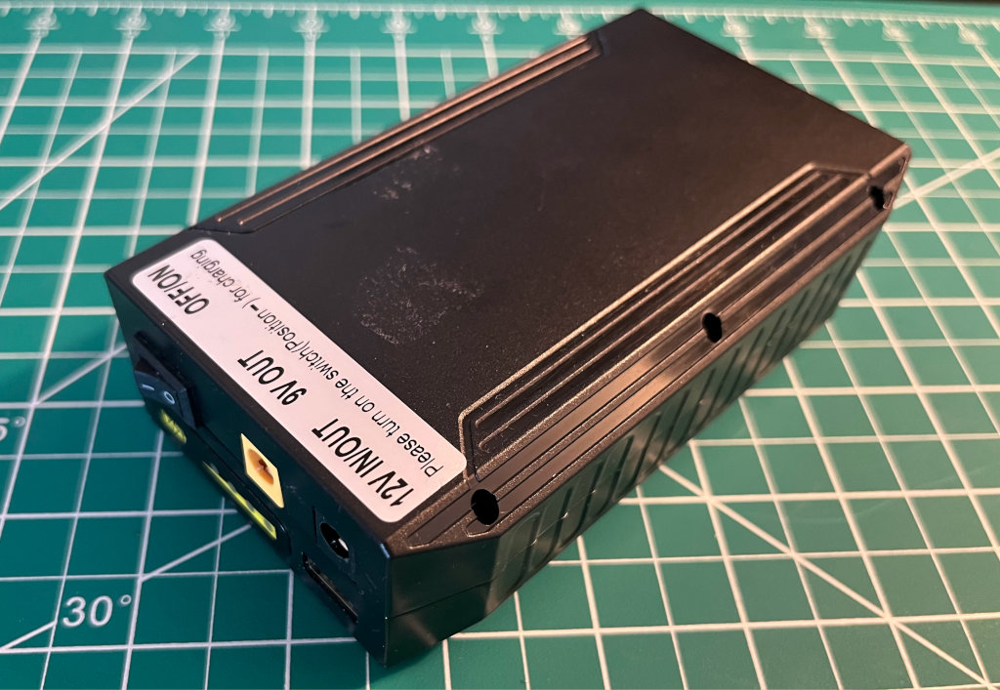

## Overview

This is the first part of the project which focuses on controlling the motors on a rover over the internet via MQTT. This article covers the hardware and software that make the whole system work.


If you want to dive right away into the code, you can check it out here:

- [Rover Hardware](https://github.com/vynci/rovy-hardware/tree/rovy-part-1) (branch -> `rovy-part-1`)
- [Mobile app](https://github.com/vynci/rovy-mobile/tree/rovy-part-1) (branch -> `rovy-part-1`)

> I will be pushing updates to the repositories as I add more things (i.e video stream) into the rover as I progress in the future, so the main branch might look different by the time you are reading this. As for this article, please refer to the specified branch.

## Hardware

The hardware comprises three main parts, which are the Chassis, Motor Driver, Control Board (Raspberry Pi), and Power supply.


### Schematic

An overview of how the hardware components are connected.


### Chassis

The chassis is composed of the frame, wheels, and motors. This is a 4-wheel drive aluminum kit that I got from Lynxmotion, and it was really easy to assemble. It has excellent traction and there is plenty of room inside for additional electronics. It includes a 12VDC motor with a 200rpm, 0.78Kg-cm GHM-16 w/ rear shaft. You can find out about the whole kit in detail [here](https://ca.robotshop.com/products/4wd1-robot-aluminum-kit).


### Motor driver

As for the motor driver, ​​I am using the [Sabertooth Dual 12A 6V-24V Regenerative Motor Driver](https://ca.robotshop.com/products/sabertooth-dual-regenerative-motor-driver) which is the new version of the Sabertooth 2x10 motor controller. It is one of the most versatile, efficient, and easy-to-use dual motor drivers on the market. It is suitable for medium-powered robots - up to 30 lbs in combat or 100 lbs for general-purpose robotics. Out of the box, the Sabertooth can supply two DC brushed motors with up to 12A each. Peak currents of 25A are achievable for a few seconds.


Sabertooth allows you to control motors with analog voltage, radio control, serial, and packetized serial. It has independent and speed+direction operating modes, making it the ideal driver for differential drive (tank style) robots.

### Raspberry Pi as the control board

To control the motors in the robot, we’ll need a computing device that can translate commands through UART (serial). We can easily do this with a microcontroller (i.e. Arduino), but in this situation, I choose a Raspberry Pi because later on I will be adding a camera that would allow us to easily stream video feeds from the robot.


On this project, I’m using a [Raspberry Pi 4](https://www.raspberrypi.com/products/raspberry-pi-4-model-b/). Lower versions of this would also work.

### Power supply

I used a Lithium-ion battery pack as it is lightweight, can handle inductive loads, and fast to charge. I got this battery bank module (72W 100WH) from [Amazon](https://amazon.ca/dp/B01337QXMA?psc=1&ref=ppx_yo2ov_dt_b_product_details) that already has a 5V and 12V output, in which I did some few modifications that would enable me to extend the on/off switch outside the enclosure.



## Software

We'll now be switching into the software side of things. If you want to skip directly into the source code, you can check it out [here](https://github.com/vynci/rovy-hardware/tree/motor-control-react-joystick)

### Send serial data using Nodejs (serial-port)

The Sabertooth Motor driver can be controlled using PWM or serial (UART TTL). We'll be using serial control as the PWM output for the Raspberry Pi is limited. The serial output from the Sabertooth will be connected to the RPi’s GPIO 14 (TXD).

I'm using [Nodejs](https://nodejs.org/en/about) as the runtime environment and the NPM module [serialport](https://www.npmjs.com/package/serialport) to interface with the Motor Driver.

Assuming you already have Nodejs installed on your system. First we'll do an npm install for the library **serialport**.

```shell
$ npm install serialport
```

And on our code side, We initialize the serial port with the serial path and baud rate. By default, the path on my RPi's serial is on `/dev/ttyS0`. This might change on different situation. And the baud rate of the Sabertooth is `9600`

```js
const { SerialPort } = require('serialport');

const port = new SerialPort({
  path: '/dev/ttyS0',
  baudRate: 9600
});
```

Then we'll need to write a function that will send serial data into the port.

```js
const portWrite = async (data) => {
  return new Promise((resolve, reject) => {
    port.write(Buffer.from([data]), function (err) {
      if (err) {
        reject(err.message);
      }
      resolve(true);
    });
  });
};
```

Then we'll need to add a listener for when the port is open and ready to use.

```js
port.on('open', async function () {
  console.log('serial port ready');
});
```

To test our motor driver, we'll send a command (once serial port is open) that will run the motors in the same direction and maximum speed.

```js
port.on('open', async function () {
  await portWrite(127);
  await portWrite(255);
});
```

This is the serial bytes (in decimals) that we send to the Sabertooth Motor driver to achieve the desired direction and speed.

- **Motors A** - `reverse: 1`, `stop: 64`, `forward: 127`
- **Motors B** - `reverse: 128`, `stop: 192`, `forward: 255`

So if we want the `Motors A` to be in full forward we send `127`, if 50% speed forward we send `96`. Same theory goes as well with `Motors B`


Now this differential in speed will allow us to steer the robot into our desired direction, this is also called [Skid Steering](https://www.mdpi.com/2076-3417/12/10/5171)

## Remote control via MQTT

Now that we can control the motors with serial using Nodejs. The next thing we can do is connect our current software to the cloud, that way we can remotely control our robot via the internet. And we will be using MQTT as the protocol for our communication.

MQTT is a standard messaging protocol for the Internet of Things (IoT). It is designed as an extremely lightweight publish/subscribe messaging transport that is ideal for connecting remote devices with a small code footprint and minimal network bandwidth. You can read more about it [here](https://mqtt.org/).

### MQTT Broker

For us to be enable to communicate around MQTT we'll need a broker. Now we can set up our own broker such as using [Mosquitto](https://mosquitto.org/) or [EMQX](https://www.emqx.io/). But in this project, we'll go for a serverless approach so we won't have to maintain or pay (initially) for a computing cloud server, and this will also get us started quickly.

### AWS IoT Core

The serverless approach we’ll be using is from AWS, the name of the service is called [AWS IoT Core](https://aws.amazon.com/iot-core/). This service lets you connect billions of IoT devices and route trillions of messages to AWS services without managing infrastructure.


To start the integration, first we need to create a device on the AWS console and attach the required policies. Under AWS IoT, go to `Manage` then `Things`, and then click on `Create things`


We'll just select the `Auto-generate` option for now. After this, you'll be asked to attach a policy, we can just initially use a wildcard `*` on the permissions. We can add a more strict security layer later on.


Once the device creation is done, we need to download the certificates and keys as we'll need this on the later steps for us to connect into the AWS IoT Core (MQTT Broker).


From this list of files, We'll be needing these 3 later on (so make sure to track this).

Save it to our creds folder and rename it as:

1. Device certificate -> `cert.crt`

2. Private key -> `private.key`

3. Amazon Root CA 1 -> `ca.pem`

Adding in the connection to AWS IoT Core in our project is easy and straightforward. First, we need to install an mqtt client [library](https://github.com/mqttjs/MQTT.js).

```shell
$ npm install mqtt
```

We are going to create the mqtt client by initiliazing with the `endpoint`, `private key`,` certificate` and `CA` that we got from the previous steps.

```js
const mqtt = require('mqtt');
const fs = require('fs');

const client = mqtt.connect(mqttEndpoint, {
  key: fs.readFileSync('./creds/private.key'),
  cert: fs.readFileSync('./creds/cert.crt'),
  ca: [fs.readFileSync('./creds/ca.pem')],
  protocolId: 'MQTT',
  protocolVersion: 5
});
```

Back on our `index.js` file, We have to add a listener for `connect` which enables us to trigger an event once the client is connected to the broker (AWS IoT Core). And we subscribe to the channel where our frontend side will publish later on.

```js
client.on('connect', () => {
  console.log('connected to mqtt broker');

  client.subscribe(mqttMotorChannel, (err) => {
    if (!err) console.log(`subscribed to [${mqttMotorChannel}]`);
  });
});
```

Next is we create another listener for incoming mqtt messages. Whenever a new message comes in from the broker, we will then parse the data and send it to the motor driver through the serial port.

```js
client.on('message', async (topic, message) => {
  const procedures = motor.calculateValues(message.toString());

  if (procedures?.length) {
    for (let step = 0; step < procedures.length; step++) {
      await portWrite(procedures[step]);
    }
  }
});
```

Those are the things that we really need on our device (Raspberry pi) side. Next is we'll need a user interface that will give us an ease to control the steering of the robot.

## Frontend

On the user interface side, We’ll want to create a mobile app with javascript that can easily be built into both iOS and Android. I’ve looked into React Native, but there seems to be only a few support for AWS libraries. For now, I’m still going to use React but with [Ionic Framework (Capacitor)](https://ionicframework.com/). If you don't want to build it as a mobile app, then you can just use plain React (or any framework) for a web app.

If you want to dive directly into the source code, get it [here](https://github.com/vynci/rovy-mobile/tree/aws-iot-core-joystick).


### Environment setup

Initiating a project with Ionic is really easy, you can follow their [documentation](https://ionicframework.com/docs/react/your-first-app) to get started.

Once you have an Ionic project already setup, we'll need to npm install a joystick component. There is a really good library for it called [react-joystick-component](https://github.com/elmarti/react-joystick-component).

```shell
$ npm install react-joystick-component
```

Next thing we need to install is the library for connecting into the AWS IoT Core (MQTT Broker).

```shell
$ npm install aws-iot-device-sdk
```

In the [source code](https://github.com/vynci/rovy-mobile), I have created a component in `JoystickControllers.tsx`. It contains the logic for both the joystick and the MQTT client connection.

### MQTT client connection

Connecting and consuming messages from MQTT is almost similar to what we have earlier on the Raspberry Pi (device) side. In the mqtt parameters we have:

```tsx
export const mqttConfig: any = {
  region: process.env.AWS_ROVY_REGION,
  host: process.env.AWS_ROVY_MQTT_ENDPOINT,
  clientId: 'rovy_' + Math.random().toString(16).substr(2, 8),
  protocol: 'wss',
  maximumReconnectTimeMs: 8000,
  accessKeyId: process.env.AWS_ROVY_KEY,
  secretKey: process.env.AWS_ROVY_SECRET,
  debug: true
};
```

We need to make sure that the AWS IAM User we have for this, has the following minimum permissions:

```json
{
  "Version": "2012-10-17",
  "Statement": [
    {
      "Effect": "Allow",
      "Action": ["iot:Connect", "iot:Publish", "iot:Subscribe", "iot:Receive"],
      "Resource": "arn:aws:iot:us-east-1:xxx:thing/xxx"
    }
  ]
}
```

Also, We need to publish on this MQTT channel. This is the channel that our device (Raspberry Pi) is listening into.

```tsx
export const mqttTopic = 'rovy/motor/c7de5c35-3882-48bc-bac6-f67fcf50da0f';
```

### Joystick UI

For the joystick component, There are a bunch of options that you can configure accordingly with looks and functionality. On this project, we’ll configure it this way.

```tsx
<Joystick
  baseColor="gray"
  stickColor="lightgray"
  size={125}
  move={steerControl}
  stop={steerStop}
  throttle={100}
></Joystick>
```

The callback functions for `move` and `stop` are being handled here:

```tsx
const steerControl = (data: any) => {
  client.publish(mqttTopic, `${data.x},${data.y}`);
};

const steerStop = (data: any) => {
  client.publish(mqttTopic, `0,0`);
};
```

As you can see, everytime these functions are called, it publishes (sends) messages to the MQTT broker with the `x,y` data that we get from the joystick component, which we'll be parsing on the Raspbery Pi side so that it can translate it to the motor driver.

### Status monitor

Last thing we need to tackle is the status monitor component. This component will help us easily indicate if the connection with the MQTT is connected or disconnected.

So on `StatusMonitor.tsx` we have a simple object that would map out the message and color of the indicator.

```tsx
const status: any = {
  pending: { color: 'orange', message: 'Connecting...' },
  reconnect: { color: 'yellow', message: 'Reconnecting...' },
  connected: { color: 'greenyellow', message: 'Connected' },
  disconnected: { color: 'orangered', message: 'Disconnected' },
  error: { color: 'orangered', message: 'Error' }
};
```

This block here will then render the message on the top portion of the view.

```tsx
return (
  <>
    <IonGrid class="status-container-top">
      <IonRow>
        <IonCol>
          <span>MQTT: </span> <span style={{ color: status[mqttStatus].color }}>{`${status[mqttStatus].message}`}</span>
        </IonCol>
      </IonRow>
    </IonGrid>
  </>
);
```

The state `mqttStatus` is being set on the `JoystickController` component where our MQTT connection workflow happens.

We then combine both of this components in the `Home` view.

```tsx
const Home: React.FC = () => {
  const [mqttStatus, setMqttStatus] = useState < string > 'pending';

  return (
    <IonPage>
      <IonContent class="main-content" fullscreen>
        <JoystickControllers setMqttStatus={setMqttStatus} />
        <StatusMonitor mqttStatus={mqttStatus} />
      </IonContent>
    </IonPage>
  );
};
```

### Testing the Ionic App

Once everything is in place and npm libraries are installed, we can run:

```shell
$ ionic serve
```


This will run a web serve instance (live reload) that you can test and develop with.

### Building into iOS or Android

Building into iOS or Android is really easy with Ionic, as they have a platform that can do all the heavy lifting for you. Using [Ionic Appflow](https://ionic.io/appflow), you won't need to setup your local environment with like Android Studio or Xcode.

You can checkout their [documentation](https://ionic.io/docs/appflow/tutorial) to link your git repository and do the whole CI/CD workflow from there.

## Summary

In this article, we have covered on how we can build a rover and control it over the internet using MQTT. We also got into the frontend (UI/UX) side of things, wherein we have used React with Ionic framework.


The next step would be to integrate a video stream into the rover, which will enable us to have a visual of the rover's point of view. I hope you enjoy reading this, and stay tuned for the upcoming updates of this project. Thank you!
