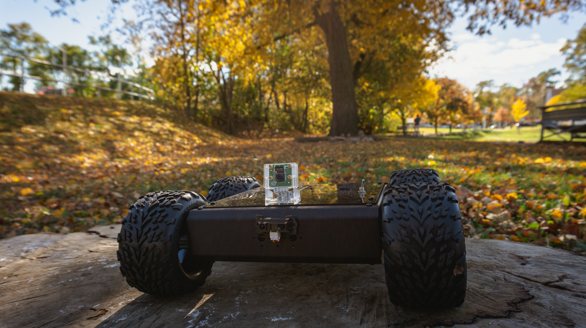

## Overview

We're now moving on to the third phase of the project, which involves the integration of an onboard 4G/LTE modem to enable remote outdoor mobility. Additionally, a new set of sensors has been introduced for telemetry transmission via AWS IoT Core using MQTT."


Our testing also extends to outdoor conditions, providing valuable assessments of the data gathered from temperature, humidity, GPS (including coordinates, speed, and altitude), IR range, and battery voltage during the rover's full-load operations.


### Recap

In [Part 2](/posts/robot-camera-video-stream-using-aws-kvs), we discussed the process of integrating the peer-to-peer video stream from the rover's onboard camera into our mobile frontend application. This was achieved through the utilization of WebRTC and AWS Kinesis Video Stream (KVS) as the Signaling Server.

### Source Code

If you want to dive right away into the code for this article, you can check it out here:

- [Rover Hardware](https://github.com/vynci/rovy-hardware/tree/rovy-part-3) (branch -> `rovy-part-3`)
- [Mobile App](https://github.com/vynci/rovy-mobile/tree/rovy-part-3) (branch -> `rovy-part-3`)

> I will be pushing updates to the repositories as I add more things into the rover as I progress in the future, so the main branch might look different by the time you are reading this. As for this article, please refer to the specified branch.

## Architecture

The diagram below illustrates the high-level view of the whole system’s workflow.


## Hardware

This schematic provides a high-level overview of the interconnections between the new hardware components and the Raspberry Pi. The 4G/LTE modem and GPS establish communication through USB, while the remaining sensors are linked via I2C.


### 4G/LTE modem

The Quectel's EC25 delivers maximum data rates up to 150 Mbps downlink and 50 Mbps uplink. Designed in the compact and unified form factor, EC25 series is compatible with Quectel multi-mode LTE Standard EC21 series/EC20-CE/EG25-G/EG21-G modules and UMTS/HSPA+ UC200A-GL module, which allows for flexible migration among them in design and manufacturing.


### Temperature and humidity

The BME280 is the next-generation of sensors from Bosch, and is the upgrade to the BMP085/BMP180/BMP183 - with a low altitude noise of 0.25m and the same fast conversion time. It has the same specifications, but can use either I2C or SPI.


This precision sensor from Bosch is the best low-cost sensing solution for measuring humidity with ±3% accuracy, barometric pressure with ±1 hPa absolute accuraccy, and temperature with ±1.0°C accuracy.

### GPS module

The GT-U7 main module GPS module using the original UBLOX 7th generation chip, Software is compatible with NEO-6M. It is equipped with high sensitivity, low power consumption, miniaturization, its extremely high tracking sensitivity greatly expanded its positioning of the coverage.


With a USB interface, it can directly connect with the RPI's point of view positioning effect. It can be attached with an IPEX antenna interface. The default distribution of active antenna can be quickly positioned.

### Analog sensors

Since the Raspberry Pi doesn't have an onboard analog-to-digital converter we are adding in the ADS1115, which provides a 16-bit precision at 860 samples/second over I2C. The chip can be configured as 4 single-ended input channels or two differential channels.


We will initially be using them to measure the analog output from the Voltage and IR Range sensors.

#### **Voltage sensor**

This module is based on a resistive divider principle design. A voltage divider is a passive linear circuit that produces an output voltage (Vout) that is a fraction of its input voltage (Vin). In our case, a ~12V from the battery will give us a proportionate value in ~5V range which the ADC (ADS1115) is able to recognize.


#### **IR Range sensor**

The Sharp distance sensors are a popular choice for many projects that require accurate distance measurements. This IR sensor is more economical than sonar rangefinders, yet it provides much better performance than other IR alternatives.


Interfacing it is straightforward: the single analog output can be connected to an analog-to-digital converter for taking distance measurements, or the output can be connected to a comparator for threshold detection. The detection range of this version is approximately 10 cm to 80 cm (4″ to 32″).

## Rover Software

### 4G/LTE QMI Setup

To enable our Raspberry Pi to communicate with the 4G/LTE modem and give internet connectivity to the rover, we'll have to run a few commands that will install the QMI interface.

In the RPi terminal, run the update and upgrade command.

```shell
$ sudo apt update && sudo apt upgrade -y
```

Install the driver for the 4G/LTE modem for mobile data connection (using QMI).

```shell
$ wget https://raw.githubusercontent.com/sixfab/Sixfab_QMI_Installer/main/qmi_install.sh
$ sudo chmod +x qmi_install.sh
$ sudo ./qmi_install.sh
```

At the end of installation, it will ask you to reboot the Raspberry Pi.

Navigate to the Quectel files that were installed in the previous step.

```shell
$ cd /opt/qmi_files/quectel-CM
```

Now run the following command to connect to the Internet.

```shell
$ sudo ./quectel-CM -s [YOUR APN]
```

To check if we got everything right

```shell
$ ping -I wwan0 -c 5 8.8.8.8
```

It should have an output like this:

```shell
PING 8.8.8.8 (8.8.8.8) from 100.65.213.248 wwan0: 56(84) bytes of data.
64 bytes from 8.8.8.8: icmp_seq=1 ttl=110 time=222 ms
64 bytes from 8.8.8.8: icmp_seq=2 ttl=110 time=194 ms
64 bytes from 8.8.8.8: icmp_seq=3 ttl=110 time=193 ms
64 bytes from 8.8.8.8: icmp_seq=4 ttl=110 time=194 ms
64 bytes from 8.8.8.8: icmp_seq=5 ttl=110 time=195 ms

--- 8.8.8.8 ping statistics ---
5 packets transmitted, 5 received, 0% packet loss, time 8ms
rtt min/avg/max/mdev = 192.947/199.606/221.875/11.168 ms
```

The next thing we need to do is to have the RPi connect automatically during startup via QMI interface.

```shell
$ wget https://raw.githubusercontent.com/sixfab/Sixfab_QMI_Installer/main/install_auto_connect.sh
$ sudo chmod +x install_auto_connect.sh
$ sudo ./install_auto_connect.sh
```

Run the install script we just downloaded.

```shell
$ sudo ./install_auto_connect.sh
```

It will ask again for the `APN`, once it is done we can check the status:

```shell
$ sudo systemctl status qmi_reconnect.service
```

If everything went well, it should have an `active` status.

```shell
● qmi_reconnect.service - QMI Auto Connection
   Loaded: loaded (/etc/systemd/system/qmi_reconnect.service; enabled; vendor preset: enabled)
   Active: active (running) since Fri 2021-01-29 12:15:25 GMT; 2min 4s ago
 Main PID: 2730 (sh)
    Tasks: 4 (limit: 3861)
   CGroup: /system.slice/qmi_reconnect.service
           ├─ 2730 /bin/sh /usr/src/qmi_reconnect.sh
           ├─13529 sudo ./quectel-CM -s super
           └─13530 ./quectel-CM -s super
```

### 4G/LTE Signal strength

To get the signal strength that we get from the modem and antenna, we have to add this serial interface code into our nodejs instance.

```js
lteSerialPort.on('open', async () => {
  await ltePortWrite('AT+CSQ\r\n');
});

lteSerialParser.on('data', (data) => {
  data = data.toString();

  if (data.includes('+CSQ:')) {
    data = data.replace('+CSQ: ', '');
    telemetry.updateLTE = data;

    console.log('data', data);
  }
});
```

The `console.log` will output something like `25,99`. This means that we have received an RSSI of `–63dBm` and channel bit error rate is `99`, this is an excellent signal strength, if the value is below `10,99` it means that the signal strength is poor. You can read more details on these possible values on the RSSI table [here](https://sixfab.com/antenna-selection/).

### GPS (Serial)

For the GPS serial interface, we have also added a new serial port instance.

```js
const GPS = require('gps');
...
const gpsSerialParser = port.pipe(new ReadlineParser({ delimiter: '\r\n' }));

gps.on('data', (data) => {
  if (gps.state.lat && gps.state.lon) {
    telemetry.updateGPS = {
      lat: { value: gps.state.lat },
      lon: { value: gps.state.lon },
      speed: { value: Math.round(gps.state.speed) },
      track: { value: Math.round(gps.state.track), unit: '°' },
      alt: { value: Math.rount(gps.state.alt), unit: 'm' }
    };
  }
});

gpsSerialParser.on('data', (data) => {
  if (
    data.includes('$GPVTG') ||
    data.includes('$GPGGA') ||
    data.includes('$GPHDT') ||
    data.includes('$GPRMC')
  )
    gps.update(data);
});
```

In the NMEA sentences, we are capturing the following protocols `$GPVTG`, `$GPGGA`, `$GPHDT`, and `GPRMC`. This will give us the latitude, longitude, speed, track and altitude that we will be sending over later on.

### BME280 (I2C)

For the temperature and humidity sensor, we added this code block.

```js
bme280
  .open({ forcedMode: true })
  .then((sensor) => {
    setInterval((_) => {
      forcedRead(sensor).then((data) => {
        telemetry.updateTemperature = Math.round(data.temperature);
        telemetry.updateHumidity = Math.round(data.humidity);
      });
    }, 15000);
  })
  .catch(console.log);
```

### Analog sensors (via ADS1115)

Lastly, we add this code block below to read the voltage from the battery and the distance measured from the IR range sensor.

```js
analogSensors.openPromisified(1).then(async (bus) => {
  const ads1115 = await ADS1115(bus);
  const full = 26480;

  setInterval(async () => {
    let value1 = await ads1115.measure('0+GND');
    let value2 = await ads1115.measure('2+GND');

    const batteryVoltage = (5 * (value2 / full)) / 0.2;
    const irRange = 5 * (value1 / full);

    telemetry.updateBattery = parseFloat(batteryVoltage.toFixed(2));
    telemetry.updateRangeSensor = parseFloat(irRange.toFixed(4));
  }, 1000);
});
```

## Frontend

### Components

On the frontend side, we have a updated the `StatusMonitor` component to accomodate and display the sensor readings from the rover.

```tsx
<IonCol size="1">
  <span>
    <IonIcon icon={flash}></IonIcon>
  </span>
  <span style={{ color: status.connected.color, fontSize: 'small' }}>
    {sensorData.battery.voltage.value || 0}
    {sensorData.battery.voltage.unit}
  </span>
</IonCol>

...

<IonCol size="5">
    <span>
        <IonIcon icon={location}></IonIcon>
    </span>
    <span style={{ color: status.connected.color, fontSize: "small" }}>
        {sensorData.gps.lat.value || 0}, {sensorData.gps.lon.value || 0}
    </span>
</IonCol>
```

A new component `GaugeControllers` have been also added to display the speed that we get from the GPS module on the rover.

```tsx
const GaugeControllers: React.FC<ContainerProps> = ({ sensorData }) => {
  return (
    <>
      <IonGrid class="gauge-container-bottom">
        <IonRow>
          <IonCol>
            <div style={{ fontSize: '4em', fontWeight: 'bold' }}>
              {sensorData.gps.speed.value || 0}
            </div>
            <div style={{ fontSize: '1.5em', fontWeight: 300 }}>km/h</div>
          </IonCol>
        </IonRow>
      </IonGrid>
    </>
  );
};
```

Lastly, there is also a new component called `ProximityWarning`. This is from the reading we get from the IR Range sensor, it will display a warning indicator if an object is within the set range, this is to avoid collisions.

```tsx
const ProximityWarning: React.FC<ContainerProps> = ({ sensorData }) => {
  return (
    <>
      <IonGrid class="proximity-warning-container-bottom">
        <IonRow>
          <IonCol>
            {sensorData.range.ir.value > 1.5 ? (
              <div style={{ fontSize: '6em', fontWeight: 'bold' }}>
                <IonIcon icon={handLeft}></IonIcon>{' '}
              </div>
            ) : (
              ''
            )}
          </IonCol>
        </IonRow>
      </IonGrid>
    </>
  );
};
```

### Integration

By adding in the new components together, the Home View now looks like this:

```tsx
const Home: React.FC = () => {
  const [mqttStatus, setMqttStatus] = useState<string>('pending');
  const [sensorData, setSensorData] = useState<any>(sensorDefaultValue);
  const [kvsStatus, setKvsStatus] = useState<string>('pending');

  return (
    <IonPage>
      <IonContent class="main-content" fullscreen>
        <JoystickControllers setMqttStatus={setMqttStatus} setSensorData={setSensorData} />
        <StatusMonitor mqttStatus={mqttStatus} kvsStatus={kvsStatus} sensorData={sensorData} />
        <KinesisWebRTC setKvsStatus={setKvsStatus}></KinesisWebRTC>
        <GaugeControllers sensorData={sensorData}></GaugeControllers>
        <ProximityWarning sensorData={sensorData}></ProximityWarning>
      </IonContent>
    </IonPage>
  );
};
```

### Testing the Ionic App

Once everything is in place and npm libraries are installed, we can run:

```shell
$ ionic serve
```


This will run a web server instance (live reload) that you can test and develop with.

## Summary

This article delves into the latest developments regarding the recently integrated onboard 4G/LTE modem and sensors. While we've conducted an outdoor test, it's worth noting that further enhancements are required for the peer-to-peer video streaming via WebRTC. Our forthcoming project steps will emphasize the enhancement of video feed stability and reduction of fragmentation to address this issue.



At the moment, the sensor data stream we receive from the rover is primarily used for display purposes. Our upcoming steps will involve harnessing this data to enhance the rover's navigation system.

I trust you find this article enjoyable, and I invite you to stay tuned for the forthcoming project updates. Thank you for your interest!
