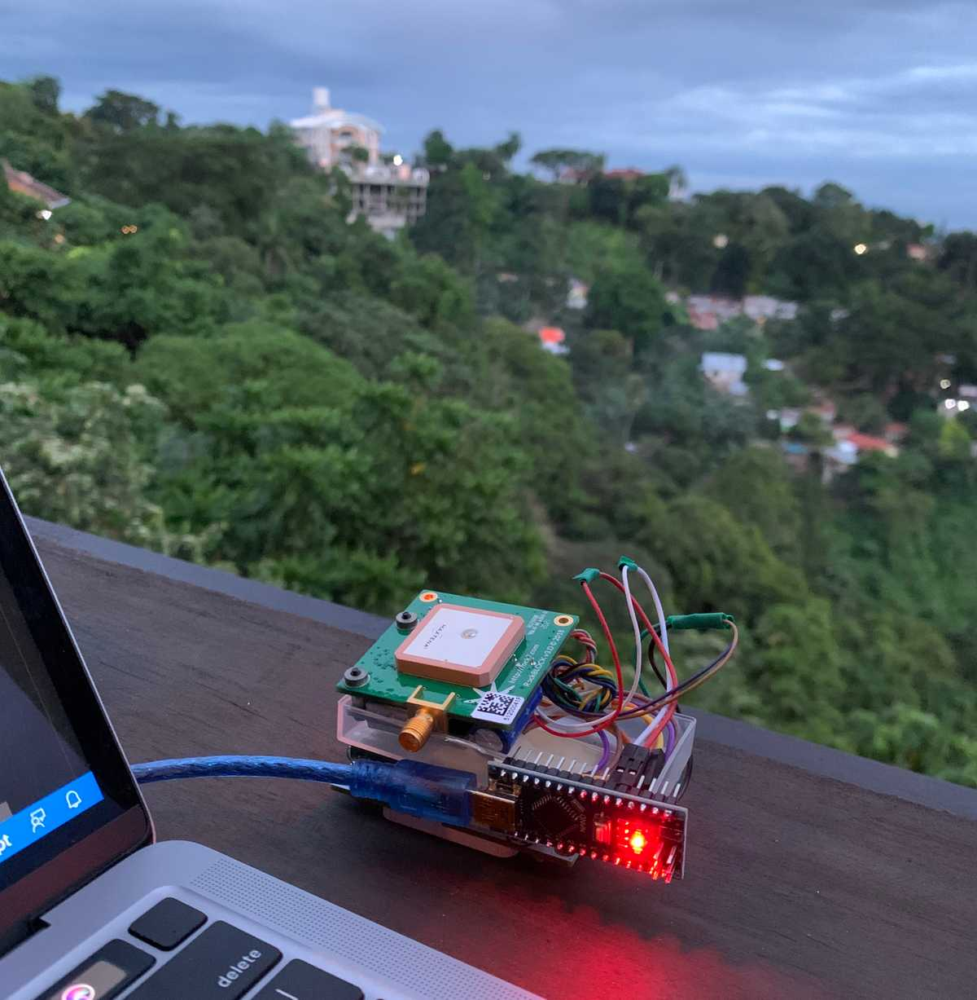
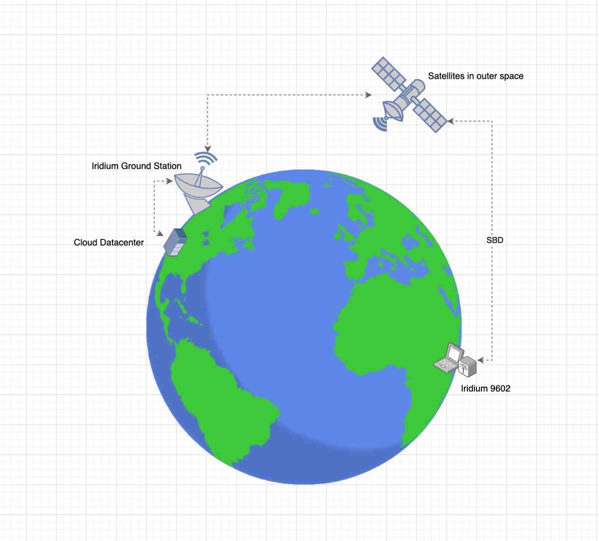
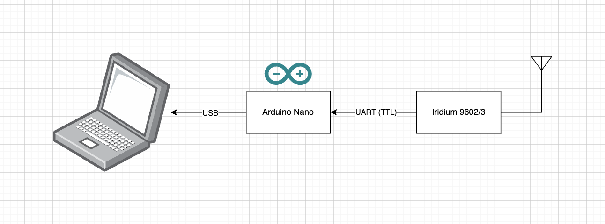

## Overview

When deploying an IoT project in a remote or offshore area, getting Internet connectivity (4G/LTE) is difficult. One solution for this is to communicate with satellites. This article will demonstrate how to talk with the Iridium 9602/3 module via the serial port using Nodejs.



We will be using the Iridium service called SBD. It is a bandwidth-limited messaging system, capable of transmitting packets of up to 340 bytes and receiving packets of 270 bytes.

SBD is suitable for applications that need to regularly send or receive small amounts of information - typically these would include tracking, telemetry, system control, and monitoring applications. It is not suitable if very low latency is required, or if the data to be transmitted is larger than a few thousand bytes. Sending images or video files is usually not sensible.

With a good view of the sky, it is possible to send/receive approximately once every 10 seconds.

## Objective

In this quick demonstration, We want to interface with an Iridium 9602/3 modem via serial port. There are a lot of Iridium service providers such as Metocean and GroundControl. In this demo, we will be using the RockBlock modem from the company called GroundControl, and use an Arduino to temporarily buffer the data to a laptop (via USB). Our code in javascript will be able to send and receive satellite messages.

If you are in a hurry, you can skip directly into the source code, you can check it out here.

## Fundamentals

Before we dive into the actual code, let us first have an overview of how a message is transmitted and received.



### Sending a message (MO - Mobile Originated)

1. The Iridium 9602 modem will send the data
2. The satellites in outer space will then relay that data back to earth.
3. Iridium ground stations will capture that data and then creates an event for the corresponding Cloud provider. You can now then perform further actions such as storing it on a database.

### Receiving a message (MT - Mobile Terminated)

1. The satellite/s will send a `Ring Alert` to the Iridium 9602 on earth.
2. The Iridium 9602 will check its inbox and download the queued message.
3. Once the message is available, we can now then perform further actions on it.

## Circuit Diagram

This is just a very simple wiring that enables our laptop (which only has USB connections) to communicate with the Iridium modem serially.



If we have a RaspberryPi in hand, then we can discard the Arduino here and have the RPi talk to the Iridium modem directly. There is also a good tutorial on this from Adafruit, you can check it out [here](https://learn.adafruit.com/using-the-rockblock-iridium-modem?view=all).

## Diving into the code

Now that we are all set, we can prepare our dev environment. Assuming we already have Nodejs installed on our system. We install first these dependencies:

```shell
$ npm install --save serialport @serialport/parser-readline
```

Before we go into the code, let us first have a look at what the final output looks like, so if we pull the repository from [Github](https://github.com/vynci/node-iridium-satellite), we can run:

```shell
$ node index.js
```

We can see here the steps on how the commands are sent. Now let's get into the code.

We initialize our code by specifying the serial path to where our Arduino is connected.

```js
const SerialPort = require('serialport');
const Readline = require('@serialport/parser-readline');

const port = new SerialPort('/dev/ttyAMA2', { baudRate: '19200' });
```

We also specified here the baud rate of the Iridium modem which is 19200.

The communication with the Iridium modem uses AT Commands you can find out about it more here. The serial port can also just process one instance and one command at a time, so we created a queue here that handles that.

```js
const shiftATCommandQueue = (queueId, status, data) => {
  atCommandQueue.shift();
  atCommandQueueEvent.emit(queueId, { status, data });

  if (atCommandQueue.length) consumeATCommandQueue();
};
```

On the send method, we return a promise:

```js
const send = async (message, retries = 10, timeout = 120000) => {
  return new Promise((resolve, reject) => {
    const id = uuid.v4();
    const timestamp = new Date().getTime();

    sendMessageQueue.push({
      id,
      message,
      retries,
      timeout,
      timestamp
    });

    sendMessageQueueEvent.on(id, ({ status, data }) => {
      const response = { id, status, data };
      if (status === 'resolve') resolve(response);
      else reject(response);

      sendMessageQueueEvent.removeListener(id);
    });

    if (sendMessageQueue.length === 1) consumeSendMessageQueue();
  });
};
```

To send a message to the satellite, we send the following AT commands to perform that:

1. AT+SBDWT=Hello world!
2. AT+SBDIX

```js
const sbdwtResult = await sendATCommand('AT+SBDWT\r', 'READY');
const messageResult = await sendATCommand(queue.message + '\r');
const sbdix = await sbdixExecute(queue.retries);
```

If all goes well and there is a clear view of the sky, it should now be able to send the message. the `AT+SBDIX` command returns a set value that represents the MO and MT status. You can read more about it [here](https://docs.rockblock.rock7.com/docs/transmit-ascii-data).

We handle that response through this parsing method here:

```js
const parseSBDIX = (str) => {
  let result = {
    MOStatus: '',
    MOMSN: '',
    MTStatus: '',
    MTMSN: '',
    MTLength: '',
    MTqueued: '',
    isValid: false
  };

  if (str.includes('+SBDIX:')) {
    const keyValue = str.split(' ');

    result = {
      MOStatus: parseInt(keyValue[1].replace(',', '')),
      MOMSN: parseInt(keyValue[2].replace(',', '')),
      MTStatus: parseInt(keyValue[3].replace(',', '')),
      MTMSN: parseInt(keyValue[4].replace(',', '')),
      MTLength: parseInt(keyValue[5].replace(',', '')),
      MTqueued: parseInt(keyValue[6].replace(',', '')),
      isValid: true
    };
  }

  return result;
};
```

If we go to index.js we can see an abstract way of sending the message.

```js
for (let i = 0; i < numberOfSatMessages; i++) {
  iridium
    .send(`Hello_Earth_${i + 1}`)
    .then((res) => {
      console.log('[OK] Send message', res);
    })
    .catch((err) => {
      console.log('[ERROR] Send message', err);
    });
}
```

To receive incoming satellite messages, we handle that on the serial parser listener block.

```js
parser.on('data', async (data) => {
    let isExpectedData = false;
    if (data.includes('SBDRING')) downloadMessage();
    ...
```

If we receive an SBDRING in the serial port, then we execute the downloadMessage() function.

```js
const downloadMessage = async () => {
  const sbdix = await sbdixExecute(15, true);
  await checkInbox(sbdix.parsedSBDIX);
};

const checkInbox = async (parsedSBDIX) => {
  let result = { message: '', isEmpty: true, sbdix: parsedSBDIX };

  const mailTimeout = setTimeout(() => {
    return result;
  }, 1 * 60000);

  if (parseInt(parsedSBDIX.MOStatus) < 4 && parseInt(parsedSBDIX.MTStatus) > 0) {
    const sbdrtResult = await sendATCommand('AT+SBDRT\r', '+SBDRT:', true);
    result.message = sbdrtResult.data;
    result.isEmpty = false;
    sbd.emit('message', result.message);

    if (parsedSBDIX.MTqueued > 0) {
      downloadMessage();
    }
  }

  clearTimeout(mailTimeout);

  return result;
};
```

Once a message is available, we trigger an emit to the event. Let's go back into index.js to see this in action.

```js
iridium.sbd.on('message', (message) => {
  console.log('Received:', message);
});
```

In a cloud provider for iridium services such as Rock7 (RockBlock), you can add some webhooks to listen for messages coming remotely from the Iridium Modem, you can check that further here. At the same time, they also have APIs that could enable you to send messages from the cloud into the Iridium Modem, you can check that further [here](https://docs.rockblock.rock7.com/reference/testinput).

That's it! you have now a working satellite transmitter and receiver using javascript (Nodejs). You can check out the whole source code here.

## Summary

We have been able to learn here the fundamentals of how the data is being passed around in satellite transmission. We have also been able to learn how to connect and talk with the Iridium 9602 modem. We have used javascript (Nodejs) as the language to send the AT commands as well as receive serial data to handle the ring alerts when have incoming messages. There are still a lot of improvements we can add to this code base to make it more production ready. But in the meantime, we can use this as a stepping stone on how we can create an IoT project that would still be able to communicate to the internet even with the absence of a 4G/LTE signal.
