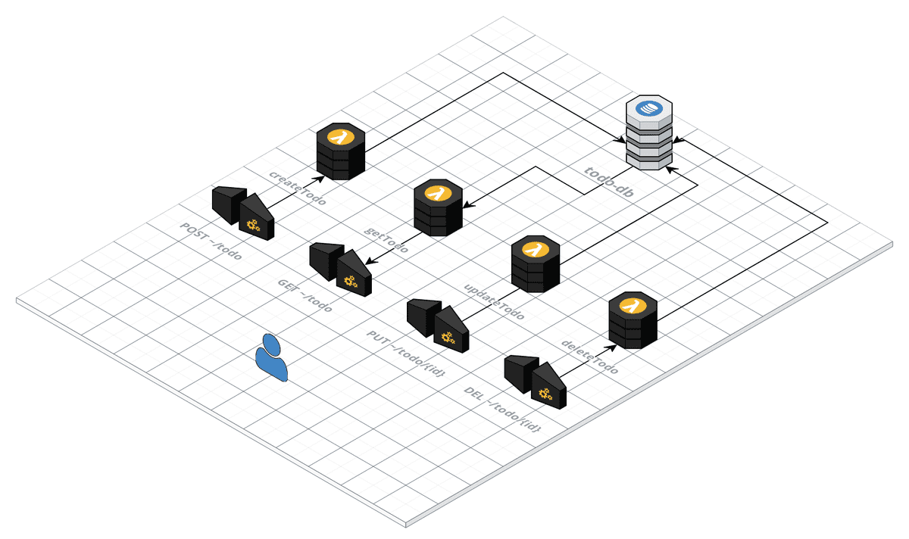

## Overview

There are a bunch of ways to build a REST API, and this article here shows one of those ways. We will be building a serverless backend, so we won't have to worry about setting up and maintaining the infrastructure, which could include load-balancing, horizontal scaling, security, etc. This implementation also includes log monitoring (through AWS CloudWatch).



If you want to get started right away, you can check out the github repository of this project [here](https://github.com/vynci/serverless-rest-api).

## Tech stack

These will be the major technology that we will be using in this project.

### Serverless Framework

It is a free and open-source web framework written using Node.js. Serverless is the first framework developed for building applications on AWS Lambda, a serverless computing platform provided by Amazon as a part of Amazon Web Services.

### NodeJs

It is an open-source, cross-platform, back-end JavaScript runtime environment that runs on the V8 engine and executes JavaScript code outside a web browser.

### AWS Lambda

It is an event-driven, serverless computing platform provided by Amazon as a part of Amazon Web Services. It is a computing service that runs code in response to events and automatically manages the computing resources required by that code.

### AWS Dynamodb

It is a fully managed proprietary NoSQL database service that supports key–value and document data structures and is offered by Amazon.com as part of the Amazon Web Services portfolio. DynamoDB exposes a similar data model to and derives its name from Dynamo, but has a different underlying implementation.

## Diving into the code

You can follow along with the source code, it is available [here](https://github.com/vynci/serverless-rest-api).

### Clone the repository

`$ git clone https://github.com/vynci/serverless-rest-api.git`

### Install and start testing the application

`$ npm install`

`$ npm start`

This will try to run a local DynamoDB simulator, and host the CRUD rest API via nodejs locally.

### Dissecting serverless.yml

Here we define all the configurations for the serverless framework to orchestrate into.

```yaml
service:
  name: todo-api-template
```

This part right here just defines the name of the service. This will also be the prepend name for the lambda function generated at a later time.

```yaml
plugins:
  - serverless-webpack
  - serverless-dynamodb-local
  - serverless-offline
```

These are the serverless-related plugins that are going to be used in both development and deployment. For now, we are using the webpack, dynamodb-local and serverless-offline.

```yaml
custom:
  stage: '${opt:stage, self:provider.stage}'
  dynamodb:
    start:
      port: 8000
      inMemory: true
      migrate: true
    migration:
      dir: offline/migrations
```

In the `custom` part, this is where the custom variables are defined, one example is the dynamodb local definitions on which port it will be exposed and the directory of the migration.

```yaml
provider:
  name: aws
  runtime: nodejs14.x
  stage: dev
  region: ap-southeast-1
  stackTags: ${file(tags.yml):${opt:stage}.stack}
  environment: ${file(env.yml):${self:custom.stage}}
  iamRoleStatements:
    - Effect: Allow
      Action:
        - dynamodb:Query
        - dynamodb:Scan
        - dynamodb:GetItem
        - dynamodb:PutItem
        - dynamodb:BatchWriteItem
        - dynamodb:UpdateItem
        - dynamodb:DeleteItem
      Resource: 'arn:aws:dynamodb:${opt:region, self:provider.region}:*:table/${self:provider.environment.todoTable}'
```

In the `provider`` section, we define here the following:

- The version of nodejs we are going to use in the lambda runtime
- The AWS region where this instance is going to be deployed
- The directory of the environment variables
- The AWS IAM Role statements, which sets the permissions of the resources that is going to be used (i.e Dynamodb)

```yaml
functions:
  getTodo:
    handler: src/todo/handler.getTodo
    memorySize: 1024
    timeout: 30
    events:
      - http:
          method: get
          path: todo/{id}
          cors: true ...
```

In the `functions` section, we define here the actual lambda functions that are going to be deployed in the cloud. We set here the path of the handler (function), the memory size, timeout, and events that it will be triggered by, which is in this case is the http (AWS API Gateway).

### Lambda function handler

These are the function codes that are going to be deployed in AWS lambda. Each of the functions defines each of the CRUD actions.

```js
import { ok, serverError } from '../aws/response';
import * as todoRepo from './todoRepo';

// Create Todo Handler
export const createTodo = async (event, context, cb) => {
  const payload = JSON.parse(event.body) || {};

  let response;

  try {
    let data = await todoRepo.createTodo(payload);
    response = ok(data);
  } catch (ex) {
    let error = { message: 'Could not save to dynamoDB', description: ex.message };
    console.log(error);
    response = serverError(error);
  }
  return cb(null, response);
};
...

```

The source code of this project is written using a [Repository Design Pattern](https://medium.com/@pererikbergman/repository-design-pattern-e28c0f3e4a30). The logic on each handler is being abstracted from the `~/src/todo/todoRepo.ts`

```js
import * as uuid from 'uuid/v1';
import { dynamodb } from '../aws/dynamodb';
const env = process.env;

export const createTodo = async (payload: any): Promise<any> => {
  const id = uuid();
  const params = {
    TableName: env.todoTable,
    Item: {
      id,
      userId: payload.userId,
      dateCreated: new Date().getTime(),
      dateUpdated: new Date().getTime(),
      content: payload.content,
      status: 'pending'
    },
    ConditionExpression: '#id <> :id',
    ExpressionAttributeNames: {
      '#id': 'id'
    },
    ExpressionAttributeValues: {
      ':id': id
    }
  };

  try {
    // write the todo item to the database
    let result: any = await dynamodb.put(params).promise();

    result = params.Item;

    return result;
  } catch (ex) {
    throw ex;
  }
};
```

### Response Handler

We also need to create the response data for each of the API requests. Under the try-catch statement in `handler.ts`, these responses are being handled accordingly in `~/src/aws/response.ts`

```js
const ok = (responseData) => {
  return {
    statusCode: 200,
    headers: { 'Access-Control-Allow-Origin': '*' },
    body: typeof responseData === 'string' ? responseData : JSON.stringify(responseData)
  };
};

const serverError = (responseData) => {
  return {
    statusCode: 500,
    headers: { 'Access-Control-Allow-Origin': '*' },
    body: typeof responseData === 'string' ? responseData : JSON.stringify(responseData)
  };
};

export { ok, serverError };
```

## Deployment

Now we have everything in place and once we are already confident about the code, we are now ready to deploy this REST API application. To do that we execute this serverless command:

`$ node --max-old-space-size=8192 ./node_modules/.bin/serverless deploy -s prod -v`

The `-s prod` parameter there defines in which environment we want to deploy this. I have set up here three resource environments (local, staging, and prod). Once everything is successful, this should already deploy the necessary AWS resources to the cloud via AWS CloudFormation.

## Summary

In this article, we have created a very simple CRUD HTTP REST API that interacts with a database (AWS DynamoDB). We have implemented this backend in a "serverless" way. We can still improve this simple implementation forward by adding an auth layer for example. I hope this article helps you with an introduction to implementing a REST API through AWS serverless resources.
